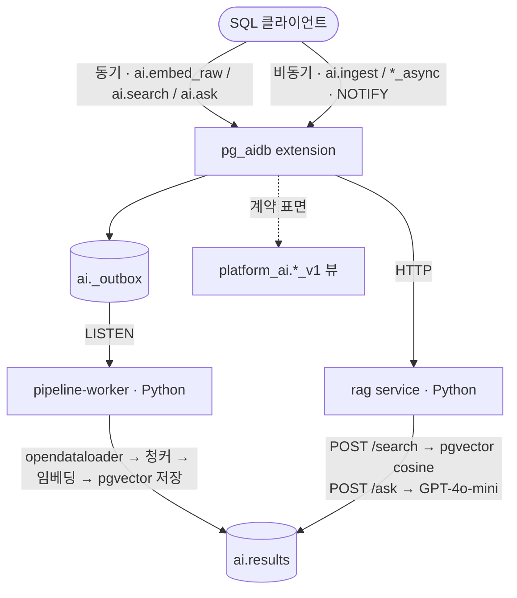

# pg_aidb

<a href="README.md">English</a> | 한국어

[](https://github.com/ysys143/pg_aidb/actions/workflows/ci.yml)
[](https://github.com/ysys143/pg_aidb/releases)

**PostgreSQL로 RAG 애플리케이션을 구동하세요.**

[설치](#설치) · [사용법](#사용법) · [기능](#주요-기능) · [작동 방식](#작동-방식) · [문서](#문서)

임베딩 · 벡터 검색 · RAG를 SQL 함수로 노출하는 in-DB AI 플랫폼. 무거운 컴퓨트(파싱 · 청킹 · 임베딩 · LLM)는 외부 마이크로서비스로 분리해 DB를 블로킹하지 않습니다.

```sql
SELECT ai.create_pipeline('docs', 'my-collection', 'default', 'default-llm', '{}');
SELECT ai.ingest('/data/paper.pdf', '', 'docs');
SELECT ai.ask('What is PostgreSQL?', 'docs');
```

> 개발 단계입니다. 아래 기능은 모두 동작·테스트되며, 향후 방향은 [`design/BACKLOG.md`](design/BACKLOG.md)에 있습니다.

---

## 왜 DB 안에서 AI를?

"임베딩도, 검색도, 생성도 SQL 한 줄로" — 매력적입니다. 그런데 PostgreSQL은 process-per-connection 모델입니다. 커넥션 하나가 곧 OS 프로세스 하나이고, 그 프로세스가 수십 초짜리 LLM 호출에 묶이면 커넥션 풀 전체가 말라붙습니다.

pg_aidb는 이 긴장을 정면으로 다룹니다. SQL 인터페이스의 편의는 가져가되, 무거운 컴퓨트는 DB 밖으로 밀어내고 비동기로 노출합니다. 무엇을 DB 안에 두고 무엇을 밖으로 빼야 하는가 — 그 경계를 어떻게 그었는지는 [설계 철학](design/DESIGN_PHILOSOPHY.md) 문서에서 다룹니다.

---

## 주요 기능

- **문서 인제스트 파이프라인.** PDF · DOCX · HWP를 외부 워커로 보내 파싱(opendataloader) → 청킹 → 임베딩 → pgvector 저장. 청킹은 `config.chunking.method`로 semantic / fixed / recursive / paragraph 선택.

- **여러 검색 모드.** dense(pgvector HNSW), hybrid(BM25 + dense + RRF), MMR diversity 재정렬, 메타데이터 필터 — `ai.search`, `ai.search_mmr`.

- **SQL 한 줄 RAG.** `ai.ask`가 검색 + 컨텍스트 조립 + LLM 생성을 한 번에 처리. 컨텍스트 윈도우 확장 지원.

- **Dual-mode API.** 가벼운 호출은 동기, 무거운 호출은 비동기(`*_async`). UUID 반환 후 `ai.results` 폴링으로 커넥션이 AI I/O에 묶이지 않음.

- **멀티 프로바이더.** 임베딩·LLM 백엔드를 `services/shared/`의 추상화 한 곳에서 교체. API 키는 컨테이너 env에만 존재(DB에는 변수 이름만).

- **안정된 계약 표면.** 내부 `ai.*` 테이블을 리팩토링해도 외부 컨슈머는 `platform_ai.*_v1` 뷰만 참조(민감 컬럼 은닉).

- **운영 기본기.** JSON 로그 + `platform_ai.usage_v1` 뷰로 비용·지연 집계, `SECURITY DEFINER` 보안 리뷰, `pg_dump`/`pg_restore` 검증, GitHub Actions CI.

---

## 핵심 개념

모든 것은 두 개의 스키마 아래에 있습니다:

- **`ai.*` — 운영 스키마.** 레지스트리와 런타임 상태를 담습니다: `ai.endpoints`(프로바이더 base URL), `ai.models`(엔드포인트에 묶인 임베딩/LLM 모델), `ai.pipelines`(임베드 모델 + LLM + 청킹 설정을 묶은 이름), `ai.chunks`(인제스트된 텍스트 + pgvector 임베딩 + 메타데이터), `ai.results`(비동기 작업/결과 큐). 호출 가능한 함수도 모두 여기에 있습니다.
- **`platform_ai.*_v1` — 안정된 계약.** 운영 테이블 위의 읽기 전용 뷰로, 민감 컬럼(API 키 env 이름 등)을 숨깁니다. 애플리케이션은 이 뷰에 의존하세요. 내부 `ai.*` 테이블을 리팩토링해도 컨슈머는 깨지지 않습니다.

레지스트리는 체인을 이룹니다: **엔드포인트**(어디로 호출) → **모델**(무엇을 호출 — 임베딩 또는 챗 모델) → **파이프라인**(어떻게 처리 — 어떤 임베드 모델, 어떤 LLM, 청킹 설정). 파이프라인 이름을 한 번 정하면 이후 모든 `ingest` / `search` / `ask` 호출이 그 이름만 참조합니다.

비동기 호출은 UUID를 반환하고 `ai.results`에 `status = 'pending'` 행을 추가합니다. 외부 워커가 `data`(또는 `error_msg`)를 채우고 `status`를 `done`/`error`로 바꿉니다. `pending_timeout_at`(기본 5분)을 넘긴 pending 행은 `error`로 정리됩니다.

---

## 설치

### 사전 준비

- Docker (Colima 또는 Docker Desktop)
- OpenAI API 키 (없으면 비용 0의 mock 모드 사용)
- PostgreSQL 17 · pgvector는 제공되는 컨테이너 이미지에 포함 (수동 설치 시 PostgreSQL 13+ 및 pgvector 필요)

### 실행

```bash
cp .env.example .env
# OPENAI_API_KEY=sk-... 채우기

cd extension && make run-rag-real
# 한 줄로: 컨테이너 기동 → extension 설치 → 인제스트 → 검색 → 답변 → 정리
```

비용 없이 mock으로 확인:

```bash
cd extension && make run-rag-mock
```

검색 모드별 시연:

```bash
make run-rag-hybrid-real    # BM25 + dense + RRF
make run-rag-mmr-real       # MMR diversity 재정렬
make run-rag-filter-real    # 메타데이터 필터
make run-rag-async-real     # NOTIFY + ai.results 폴링
```

---

## 사용법

### 함수 레퍼런스

| 함수 | 파라미터 (기본값) | 반환 |
|---|---|---|
| `ai.create_pipeline` | `name, collection='default', embed_model='default', llm_model='default-llm', config jsonb='{}'` | `void` |
| `ai.ingest` | `source, content='', pipeline='default'` | `uuid` |
| `ai.search` | `query, pipeline='default', top_k=0, filter jsonb='{}'` | `table(chunk_id, content, similarity, source, metadata)` |
| `ai.search_mmr` | `query, pipeline='default', top_k=5, fetch_k=20, lambda_param=0.5, filter jsonb='{}'` | `ai.search`와 동일 |
| `ai.ask` | `query, pipeline='default', top_k=0, max_context_tokens=3000, strategy='prune'` | `text` |
| `ai.embed_raw` | `input, model='default'` | `float4[]` |
| `ai.search_async` | `query, pipeline='default', top_k=0` | `uuid` |
| `ai.ask_async` | `query, pipeline='default'` | `uuid` |
| `ai.embed_async` | `input, model='default'` | `uuid` |

워크플로는 네 단계입니다 — 파이프라인 정의, 문서 인제스트, 검색, 질의응답.

**1. 파이프라인 정의.** 임베딩 모델 · LLM · 청킹 설정을 묶어 이름을 붙입니다. `config`는 청킹/검색 설정을 담는 JSONB입니다(예: `{"chunking": {"method": "semantic"}, "top_k": 5}`). 이 호출은 멱등적이며 `name` 기준으로 upsert 합니다.

```sql
SELECT ai.create_pipeline(
  'docs',                                  -- 파이프라인 이름
  'my-collection',                         -- 논리적 컬렉션
  'default',                               -- 임베딩 모델 (ai.models 참조)
  'default-llm',                           -- LLM 모델
  '{"chunking": {"method": "semantic"}}'   -- config
);
```

**2. 문서 인제스트.** `source`에 파일 경로를 넘기면 워커가 읽어 파싱하고, `content`에 원문 텍스트를 직접 넘길 수도 있습니다. 비동기로 동작하며 추적용 UUID를 반환합니다. 워커가 파싱 · 청킹 · 임베딩 후 `ai.chunks`에 저장합니다.

```sql
SELECT ai.ingest('/data/paper.pdf', '', 'docs');      -- 파일에서
SELECT ai.ingest('', 'raw text to embed', 'docs');    -- 인라인 텍스트에서
```

**3. 검색.** 질의를 임베딩해 가장 유사한 청크를 `(chunk_id, content, similarity, source, metadata)`로 반환합니다. `top_k=0`이면 파이프라인에 설정된 `top_k`를 사용합니다. `filter`는 JSONB 포함 연산(`metadata @> filter`)으로 결과를 제한합니다.

```sql
SELECT * FROM ai.search('vector index internals', 'docs', 5);

-- metadata가 {"source": "paper.pdf"}를 포함하는 청크만
SELECT * FROM ai.search('vector index internals', 'docs', 5, '{"source": "paper.pdf"}');
```

다양성이 필요하면(거의 중복된 청크 회피) `ai.search_mmr`가 `fetch_k`개 후보를 MMR(Maximal Marginal Relevance)로 재정렬해 `top_k`개로 줄입니다. `lambda_param`은 관련성(`1.0`)과 다양성(`0.0`) 사이의 가중치입니다.

```sql
SELECT * FROM ai.search_mmr('vector index internals', 'docs', 5, 20, 0.5);
```

**4. 질의응답(RAG).** 검색 · 컨텍스트 조립 · LLM 생성을 한 번에 처리하고 답변 텍스트를 반환합니다. `max_context_tokens`는 조립된 컨텍스트 상한이고, `strategy`는 청크가 예산을 넘을 때 컨텍스트를 다듬는 방식입니다(`'prune'`).

```sql
SELECT ai.ask('What is an HNSW index?', 'docs');
SELECT ai.ask('What is an HNSW index?', 'docs', 8, 4000, 'prune');
```

**프로덕션 — 비동기 폴링.** 무거운 호출은 `*_async` 변형이 UUID를 즉시 반환하므로 커넥션이 LLM 호출에 묶이지 않습니다. `ai.results`를 `request_id`로 폴링합니다.

```sql
SELECT ai.ask_async('Explain MVCC', 'docs');   -- request UUID 반환

SELECT status, data, error_msg, finished_at
FROM ai.results
WHERE request_id = '...'::uuid;
-- status: 'pending' → 'done'(data 채워짐) 또는 'error'(error_msg 채워짐)
```

전체 시나리오는 [`design/PLAYBOOK.md`](design/PLAYBOOK.md), 개발 환경 셋업은 [`design/DEV_GUIDE.md`](design/DEV_GUIDE.md)를 참고하세요.

---

## 작동 방식

extension은 큐 · 결과 영속 · SQL 표면만 맡고, 무거운 컴퓨트는 전부 외부 Python 서비스가 담당합니다. 가벼운 호출만 동기로, 무거운 호출은 비동기(NOTIFY + `ai.results` 폴링)로 노출합니다.



| 컴포넌트 | 언어 | 책임 |
|---|---|---|
| `extension/` | Rust (pgrx 0.18) | SQL 인터페이스, HTTP 라우팅. 비즈니스 로직 없음. |
| `services/pipeline-worker/` | Python (FastAPI) | LISTEN → 파싱 → 청킹 → 임베딩 → 저장 |
| `services/rag/` | Python (FastAPI) | `/search` `/ask` `/v1/embeddings` HTTP API |
| `services/shared/` | Python | embedder · llm · chunker · structured_log 추상화 |

설계 근거는 [`design/DESIGN_PHILOSOPHY.md`](design/DESIGN_PHILOSOPHY.md)와 [`design/DECISIONS.md`](design/DECISIONS.md)(ADR-001~006)에 있습니다.

---

## 성능

로컬 Docker(Colima/aarch64), PostgreSQL 17 · pgvector 0.8 기준 검색 지연(query 임베딩 API 호출 포함):

| 모드 | p50 | p95 | p99 |
|---|---|---|---|
| Dense (pgvector HNSW) | 229ms | 287ms | 297ms |
| Hybrid (BM25 + dense + RRF) | 228ms | 316ms | 336ms |
| MMR (fetch_k=20, λ=0.5) | 242ms | 266ms | 271ms |

측정 방법과 전체 수치는 [`design/BENCHMARKS.md`](design/BENCHMARKS.md)에 있습니다.

---

## 문서

| 파일 | 내용 |
|---|---|
| [design/ARCHITECTURE.md](design/ARCHITECTURE.md) | 컴포넌트 구성과 데이터 흐름 |
| [design/DESIGN_PHILOSOPHY.md](design/DESIGN_PHILOSOPHY.md) | 설계의 근본 제약과 결정 배경 |
| [design/DECISIONS.md](design/DECISIONS.md) | 주요 결정 기록 (ADR-001~006) |
| [design/HANDOFF.md](design/HANDOFF.md) | pgrx 0.18 구현 패턴과 함정 |
| [design/PLAYBOOK.md](design/PLAYBOOK.md) | 수동 테스트 시나리오 |
| [design/DEV_GUIDE.md](design/DEV_GUIDE.md) | 개발 환경 셋업과 자주 겪는 함정 |
| [design/SECURITY.md](design/SECURITY.md) | 위협 모델과 ACL 권장 사항 |
| [design/BENCHMARKS.md](design/BENCHMARKS.md) | 성능 측정 결과 |
| [design/GPU_STRATEGY.md](design/GPU_STRATEGY.md) | GPU 가속 로드맵 (pg_cuvs 연동) |
| [design/BACKLOG.md](design/BACKLOG.md) | 로드맵과 진행 현황 |

---

## 기여

이슈와 PR을 환영합니다. [`design/DEV_GUIDE.md`](design/DEV_GUIDE.md)의 개발 환경 셋업과 자주 겪는 함정을 먼저 읽어 주세요.

## 라이선스

[PostgreSQL License](LICENSE).
