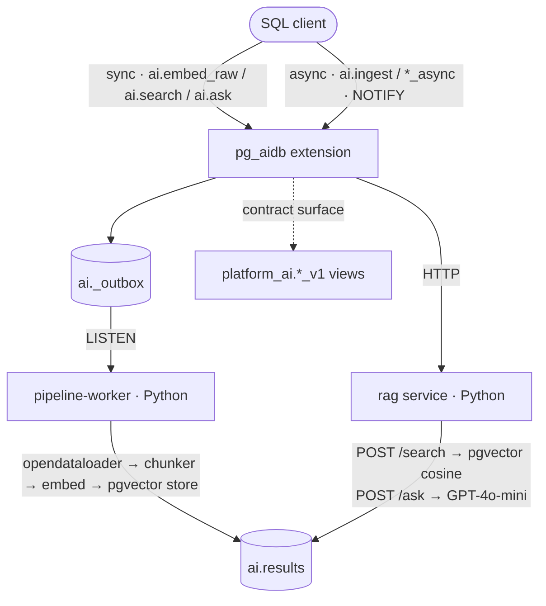

# pg_aidb

English | <a href="README.ko.md">한국어</a>

[](https://github.com/ysys143/pg_aidb/actions/workflows/ci.yml)
[](https://github.com/ysys143/pg_aidb/releases)

**Power your RAG applications with PostgreSQL.**

[Install](#install) · [Usage](#usage) · [Features](#features) · [How it works](#how-it-works) · [Docs](#docs)

An in-DB AI platform that exposes embedding, vector search, and RAG as SQL functions. Heavy compute (parsing, chunking, embedding, LLM calls) runs in external microservices, so it never blocks the database.

```sql
SELECT ai.create_pipeline('docs', 'my-collection', 'default', 'default-llm', '{}');
SELECT ai.ingest('/data/paper.pdf', '', 'docs');
SELECT ai.ask('What is PostgreSQL?', 'docs');
```

> Under active development. The features below all work and are tested; the roadmap lives in [`design/BACKLOG.md`](design/BACKLOG.md).

---

## Why AI inside the database?

"Embed, search, and generate in one line of SQL" is appealing. But PostgreSQL uses a process-per-connection model: one connection is one OS process, and once that process is stuck in a multi-second LLM call, the whole connection pool dries up.

pg_aidb confronts this tension head-on. It keeps the convenience of the SQL interface but pushes heavy compute out of the database and exposes it asynchronously. What belongs inside the database and what must stay outside — and how that line was drawn — is covered in [DESIGN_PHILOSOPHY.md](design/DESIGN_PHILOSOPHY.md).

---

## Features

- **Document ingestion pipeline.** Sends PDF · DOCX · HWP to an external worker for parsing (opendataloader) → chunking → embedding → pgvector storage. Chunking method is selectable via `config.chunking.method`: semantic / fixed / recursive / paragraph.

- **Multiple search modes.** dense (pgvector HNSW), hybrid (BM25 + dense + RRF), MMR diversity reranking, and metadata filtering — `ai.search`, `ai.search_mmr`.

- **RAG in one line of SQL.** `ai.ask` handles search + context assembly + LLM generation in a single call, with context-window expansion.

- **Dual-mode API.** Light calls run synchronously; heavy calls run asynchronously (`*_async`), returning a UUID you poll via `ai.results` so connections are never tied up by AI I/O.

- **Multi-provider.** Swap embedding and LLM backends in one place — the abstraction under `services/shared/`. API keys live only in the container env (the DB stores just the variable name).

- **Stable contract surface.** Internal `ai.*` tables can be refactored freely; external consumers only read the `platform_ai.*_v1` views (sensitive columns hidden).

- **Operational basics.** Cost/latency aggregation via JSON logs and the `platform_ai.usage_v1` view, `SECURITY DEFINER` security review, `pg_dump`/`pg_restore` verification, and GitHub Actions CI.

---

## Core concepts

Everything lives under two schemas:

- **`ai.*` — the operational schema.** Holds the registry and runtime state: `ai.endpoints` (provider base URLs), `ai.models` (named embedding/LLM models bound to an endpoint), `ai.pipelines` (a named bundle of embed model + LLM + chunking config), `ai.chunks` (ingested text plus its pgvector embedding and metadata), and `ai.results` (the async job/result queue). All callable functions live here too.
- **`platform_ai.*_v1` — the stable contract.** Read-only views over the operational tables, with sensitive columns (such as API-key env names) hidden. Build your application against these views; the underlying `ai.*` tables can be refactored without breaking consumers.

The registry forms a chain: an **endpoint** (where to call) → a **model** (what to call — an embedding or chat model) → a **pipeline** (how to process: which embed model, which LLM, and the chunking config). You name a pipeline once, and every `ingest` / `search` / `ask` call simply references that name.

Asynchronous calls return a UUID and insert a row into `ai.results` with `status = 'pending'`. The external worker fills in `data` (or `error_msg`) and flips `status` to `done`/`error`. A row left pending past `pending_timeout_at` (default 5 minutes) is reaped to `error`.

---

## Install

### Prerequisites

- Docker (Colima or Docker Desktop)
- An OpenAI API key (or use the zero-cost mock mode)
- PostgreSQL 17 and pgvector ship in the provided container image (a manual install needs PostgreSQL 13+ and pgvector)

### Run

```bash
cp .env.example .env
# fill in OPENAI_API_KEY=sk-...

cd extension && make run-rag-real
# one command: start containers → install extension → ingest → search → answer → clean up
```

Verify with no cost using mock:

```bash
cd extension && make run-rag-mock
```

Demos per search mode:

```bash
make run-rag-hybrid-real    # BM25 + dense + RRF
make run-rag-mmr-real       # MMR diversity reranking
make run-rag-filter-real    # metadata filtering
make run-rag-async-real     # NOTIFY + ai.results polling
```

---

## Usage

### Function reference

| Function | Parameters (with defaults) | Returns |
|---|---|---|
| `ai.create_pipeline` | `name, collection='default', embed_model='default', llm_model='default-llm', config jsonb='{}'` | `void` |
| `ai.ingest` | `source, content='', pipeline='default'` | `uuid` |
| `ai.search` | `query, pipeline='default', top_k=0, filter jsonb='{}'` | `table(chunk_id, content, similarity, source, metadata)` |
| `ai.search_mmr` | `query, pipeline='default', top_k=5, fetch_k=20, lambda_param=0.5, filter jsonb='{}'` | same as `ai.search` |
| `ai.ask` | `query, pipeline='default', top_k=0, max_context_tokens=3000, strategy='prune'` | `text` |
| `ai.embed_raw` | `input, model='default'` | `float4[]` |
| `ai.search_async` | `query, pipeline='default', top_k=0` | `uuid` |
| `ai.ask_async` | `query, pipeline='default'` | `uuid` |
| `ai.embed_async` | `input, model='default'` | `uuid` |

The workflow has four steps — define a pipeline, ingest documents, search, and ask.

**1. Define a pipeline.** Bundle an embedding model, an LLM, and a chunking config under a name. `config` is a JSONB blob carrying chunking/retrieval settings (for example `{"chunking": {"method": "semantic"}, "top_k": 5}`). The call is idempotent — it upserts on `name`.

```sql
SELECT ai.create_pipeline(
  'docs',                                  -- pipeline name
  'my-collection',                         -- logical collection
  'default',                               -- embedding model (from ai.models)
  'default-llm',                           -- LLM model
  '{"chunking": {"method": "semantic"}}'   -- config
);
```

**2. Ingest documents.** Pass a file path in `source` (the worker reads and parses it) or raw text in `content`. The call runs asynchronously and returns a tracking UUID; the worker parses, chunks, embeds, and stores into `ai.chunks`.

```sql
SELECT ai.ingest('/data/paper.pdf', '', 'docs');      -- from a file
SELECT ai.ingest('', 'raw text to embed', 'docs');    -- from inline text
```

**3. Search.** Embeds the query and returns the most similar chunks as `(chunk_id, content, similarity, source, metadata)`. `top_k=0` falls back to the pipeline's configured `top_k`. The `filter` argument restricts results by JSONB containment (`metadata @> filter`).

```sql
SELECT * FROM ai.search('vector index internals', 'docs', 5);

-- only chunks whose metadata contains {"source": "paper.pdf"}
SELECT * FROM ai.search('vector index internals', 'docs', 5, '{"source": "paper.pdf"}');
```

For diversity (avoiding near-duplicate chunks), `ai.search_mmr` reranks `fetch_k` candidates down to `top_k` by Maximal Marginal Relevance. `lambda_param` trades off relevance (`1.0`) against diversity (`0.0`).

```sql
SELECT * FROM ai.search_mmr('vector index internals', 'docs', 5, 20, 0.5);
```

**4. Ask (RAG).** Search + context assembly + LLM generation in one call, returning the answer text. `max_context_tokens` caps the assembled context; `strategy` controls how context is trimmed when chunks exceed that budget (`'prune'`).

```sql
SELECT ai.ask('What is an HNSW index?', 'docs');
SELECT ai.ask('What is an HNSW index?', 'docs', 8, 4000, 'prune');
```

**Production — async polling.** Heavy calls have `*_async` variants that return a UUID immediately, so the connection is never tied up by the LLM call. Poll `ai.results` by `request_id`:

```sql
SELECT ai.ask_async('Explain MVCC', 'docs');   -- returns a request UUID

SELECT status, data, error_msg, finished_at
FROM ai.results
WHERE request_id = '...'::uuid;
-- status: 'pending' → 'done' (data filled) or 'error' (error_msg filled)
```

For full scenarios see [`design/PLAYBOOK.md`](design/PLAYBOOK.md), and for dev setup see [`design/DEV_GUIDE.md`](design/DEV_GUIDE.md).

---

## How it works

The extension handles only the queue, result persistence, and the SQL surface; all heavy compute runs in external Python services. Light calls are synchronous; heavy calls are asynchronous (NOTIFY + `ai.results` polling).



| Component | Language | Responsibility |
|---|---|---|
| `extension/` | Rust (pgrx 0.18) | SQL interface and HTTP routing. No business logic. |
| `services/pipeline-worker/` | Python (FastAPI) | LISTEN → parse → chunk → embed → store |
| `services/rag/` | Python (FastAPI) | `/search` `/ask` `/v1/embeddings` HTTP API |
| `services/shared/` | Python | embedder · llm · chunker · structured_log abstractions |

The rationale lives in [`design/DESIGN_PHILOSOPHY.md`](design/DESIGN_PHILOSOPHY.md) and [`design/DECISIONS.md`](design/DECISIONS.md) (ADR-001~006).

---

## Performance

Search latency on local Docker (Colima/aarch64), PostgreSQL 17 · pgvector 0.8 (includes the query embedding API call):

| Mode | p50 | p95 | p99 |
|---|---|---|---|
| Dense (pgvector HNSW) | 229ms | 287ms | 297ms |
| Hybrid (BM25 + dense + RRF) | 228ms | 316ms | 336ms |
| MMR (fetch_k=20, λ=0.5) | 242ms | 266ms | 271ms |

Methodology and full numbers are in [`design/BENCHMARKS.md`](design/BENCHMARKS.md).

---

## Docs

| File | Contents |
|---|---|
| [design/ARCHITECTURE.md](design/ARCHITECTURE.md) | Component layout and data flow |
| [design/DESIGN_PHILOSOPHY.md](design/DESIGN_PHILOSOPHY.md) | Core constraints and the reasoning behind decisions |
| [design/DECISIONS.md](design/DECISIONS.md) | Decision records (ADR-001~006) |
| [design/HANDOFF.md](design/HANDOFF.md) | pgrx 0.18 implementation patterns and pitfalls |
| [design/PLAYBOOK.md](design/PLAYBOOK.md) | Manual test scenarios |
| [design/DEV_GUIDE.md](design/DEV_GUIDE.md) | Dev environment setup and common pitfalls |
| [design/SECURITY.md](design/SECURITY.md) | Threat model and ACL recommendations |
| [design/BENCHMARKS.md](design/BENCHMARKS.md) | Performance measurements |
| [design/GPU_STRATEGY.md](design/GPU_STRATEGY.md) | GPU acceleration roadmap (pg_cuvs integration) |
| [design/BACKLOG.md](design/BACKLOG.md) | Roadmap and progress |

---

## Contributing

Issues and PRs are welcome. Please read the dev environment setup and common pitfalls in [`design/DEV_GUIDE.md`](design/DEV_GUIDE.md) first.

## License

[PostgreSQL License](LICENSE).
